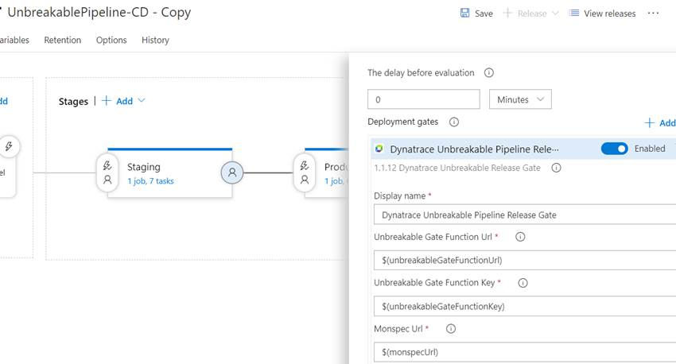
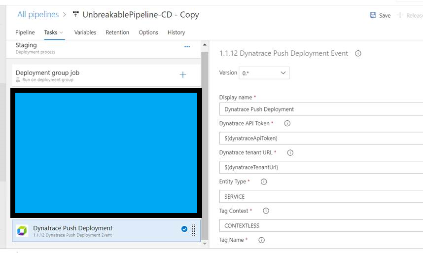

# Dynatrace Unbreakable Pipeline Extension for VSTS

The Dynatrace Unbreakable Pipeline VSTS Extension has two extensions that help enable the Dynatrace Unbreakable Pipeline in VSTS

- Unbreakable Pipeline Release Gate - This release gate uses a monspec file and a Dynatrace tenant to automate the approval between environments based on performance data captured while running continuous performance tests after a release.
- Push Deployment Event Task - This build/release task sends a Deployment Event to a Dynatrace Tennant

## Prerequisites

### Dynatrace Unbreakable Pipeline Gate - Azure Function

The release gate uses an [Azure function](https://azure.microsoft.com/en-us/services/functions/) for a serverless on-demand processing of performance data captured while running performance tests during a release. The code for this function is [here](https://github.com/dynatrace-innovationlab/unbreakable-pipeline-vsts/tree/master/UnbreakablePipelineGate/DynatraceUnbreakablePipelineFunction).

### Dynatrace Unbreakable Pipeline Proxy

The release gate also uses a proxy which consists of a VM with python installed and the Dynatrace CLI. The proxy code uses the Dynatrace CLI to pull monspec info from Dynatrace.

The code for the proxy is [here](https://github.com/dynatrace-innovationlab/unbreakable-pipeline-vsts/tree/master/UnbreakablePipelineProxy).

Need to make this into a container. Would be super cool to have this deployed in [Azure Container Instance](https://azure.microsoft.com/en-us/services/container-instances/) and have the gate launch this.

## Dynatrace Unbreakable Pipeline Release Gate
Installing the extension adds the following 'Dynatrace Unbreakable Pipeline Release Gate'.



### Input parameters
The gate requires the following 9 inputs:

- Unbreakable Gate Function Url: The url to the unbreakable gate Azure function
- Unbreakable Gate Function Key: The default key to the unbreakable gate azure function
- Monspec Url: The url to the monspec file. The build should upload the monspec file to a accesable url so the gate can download and use it.
- Pipeline Info Url: The url to the pipeline info file. The build should upload the pipeline info file to an accesable url so the gate can download and use it.
- Dynatrace Tenant Url: The url to your dynatrace tenant.
- Dynatrace Token: Token to your dynatrace tenant.
- Dynatrace Proxy Url: Url to the Dynatrace proxy.
- Service To Compare: The service to compare.
- Compare Window: The windo of time in minutes to compare.

The gate also requres the following 8 VSTS parameters that are defaulted with the correct value.

- VSTS Plan Url
- VSTS Project Id
- Hub Name
- Plan Id
- Job Id,
- Timeline Id,
- Task Instance Id,
- Authentication Token

## Dynatrace Push Deployment Event Task

This extension also comes with a build and release task which sends a Deployment Event to your dynatrace tenant. This task should be called after deploying to an environment. This deployment event is used by Dynatrace in the self healing use case.



### Input parameters

Sending a deployment event to dynatrace requires the following parameters

- Dynatrace tenant token: Token to your dynatrace tenant.
- Dynatrace tenant Url: Url to youor dynatrace tenant.
- Entity Type: The entity type
- Tag Context: The context used in the tag
- Tag Name: The name of the tag
- Tag Value: The value of the tag. For this example, the tag value will be the name of the environment.
- Deployment Name: The release definition name
- Deployment Version: The release ID
- Deployment Project: The team project name
- CI Link: The url to VSTS
- VSTS Url: The url to VSTS
- Release Url: The url to the release in VSTS
- Git Commit: The commit ID which triggered the release


# Developer Notes

development requires node and this node package ```npm install -g tfx-cli```

optional use the ```build_extension.bat``` to make the vsix file


### Reference 

* task schema - https://github.com/Microsoft/azure-pipelines-task-lib/blob/master/tasks.schema.json
* Developer Guide - https://docs.microsoft.com/en-us/azure/devops/extend/develop/add-build-task?view=vsts
* manifest reference - https://docs.microsoft.com/en-us/azure/devops/extend/develop/manifest?view=vsts
* getting started guide - https://docs.microsoft.com/en-us/azure/devops/extend/get-started/node?view=vsts
* GUID generator - https://www.guidgen.com/
