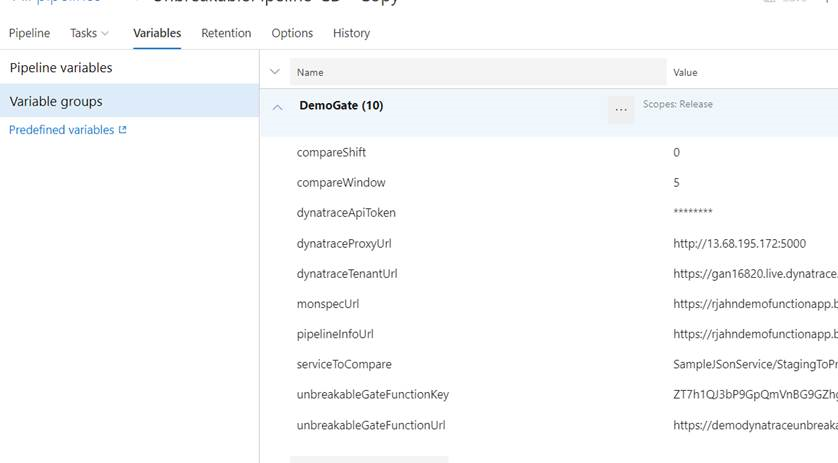
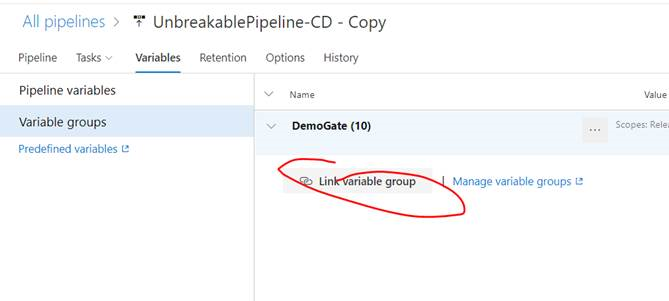

# Dynatrace Unbreakable Pipeline Extension for VSTS

The Dynatrace Unbreakable Pipeline VSTS Extension has two extensions that help enable the Dynatrace Unbreakable Pipeline in VSTS

- Unbreakable Pipeline Release Gate - This release gate uses a monspec file and a Dynatrace tenant to automate the approval between environments based on performance data captured while running continuous performance tests after a release.
- Push Deployment Event Task - This build/release task sends a Deployment Event to a Dynatrace Tennant

## Prerequisites

### Dynatrace Unbreakable Pipeline Gate - Azure Function

The release gate uses an [Azure function](https://azure.microsoft.com/en-us/services/functions/) for a serverless on-demand processing of performance data captured while running performance tests during a release. The code for this function is [here](https://github.com/dynatrace-innovationlab/unbreakable-pipeline-vsts/tree/master/UnbreakablePipelineGate/DynatraceUnbreakablePipelineFunction).

### Dynatrace Unbreakable Pipeline Proxy

The release gate also uses a proxy which consists of a VM with python installed and the Dynatrace CLI. The proxy code uses the Dynatrace CLI to pull monspec info from Dynatrace.

The code for the proxy is [here](https://github.com/robertjahn/dtcli-webproxy).

Need to make this into a container. Would be super cool to have this deployed in [Azure Container Instance](https://azure.microsoft.com/en-us/services/container-instances/) and have the gate launch this.

## Extention Inputs

The extension parameters will default to builtin DevOps pipeline variables or custom variables.  You don't need to do anything to use the builtin ones, but you need to define variables and values or override the defaults for the custom ones.

Here are the custom variables to use.
* unbreakableGateFunctionUrl = <YOUR URL> - e.g. https://demodynatraceunbreakablepipeline.azurewebsites.net/api/ProcessUnbreakableGate
* unbreakableGateFunctionKey = <YOUR FUNCTION TOKEN>
* monspecUrl = e.g. https://rjahndemofunctionapp.blob.core.windows.net/monspec/smplmonspec.json
* pipelineInfoUrl = e.g. https://rjahndemofunctionapp.blob.core.windows.net/monspec/smplpipelineinfo.json
* dynatraceTennantUrl = <YOUR TENANT> e.g. https://<YOUR TENTANT>.live.dynatrace.com
* dynatraceApiToken = <YOUR TOKEN>
* dynatraceProxyUrl – there is not path at the end now… just server & port e.g. http://13.68.195.172:5000
* serviceToCompare = e.g. SampleJSonService/StagingToProduction
* compareWindow = e.g. 5 - or number of minutes value
* compareShift = e.g. 0 - or number of minutes value

Here is a screen shot of a variable group.  


The group can be linked to the pipeline for reuse and easier maintenance.


## Dynatrace Unbreakable Pipeline Release Gate
Installing the extension adds the following 'Dynatrace Unbreakable Pipeline Release Gate'.


### Input parameters
The gate requires the following inputs:

- Unbreakable Gate Function Url: The url to the unbreakable gate Azure function
- Unbreakable Gate Function Key: The default key to the unbreakable gate azure function
- Monspec Url: The url to the monspec file. The build should upload the monspec file to a accesable url so the gate can download and use it.
- Pipeline Info Url: The url to the pipeline info file. The build should upload the pipeline info file to an accesable url so the gate can download and use it.
- Dynatrace Tenant Url: The url to your dynatrace tenant.
- Dynatrace Token: Token to your dynatrace tenant.
- Dynatrace Proxy Url: Url to the Dynatrace proxy.
- Service To Compare: The service to compare.
- Compare Type: Valid values are pullcompare or pull
- Compare Window: The window of time in minutes to compare.
- Compare Time Shift: Used for comparetype=pull only. The number of minutes to shift relative to now.

The gate also requres the following VSTS parameters that are defaulted with the correct value using references to builtin DevOps pipeline variables.

- VSTS Plan Url
- VSTS Project Id
- Hub Name
- Plan Id
- Job Id,
- Timeline Id,
- Task Instance Id,
- Authentication Token

## Dynatrace Push Deployment Event Task

This extension also comes with a build and release task which sends a Deployment Event to your dynatrace tenant. This task should be called after deploying to an environment. This deployment event is used by Dynatrace in the self healing use case.


### Input parameters

Sending a deployment event to dynatrace requires the following parameters

- Dynatrace tenant token: Token to your dynatrace tenant.
- Dynatrace tenant Url: Url to youor dynatrace tenant.
- Entity Type: The entity type
- Tag Context: The context used in the tag
- Tag Name: The name of the tag
- Tag Value: The value of the tag. For this example, the tag value will be the name of the environment.

The gate also requres the following VSTS parameters that are defaulted with the correct value using references to builtin DevOps pipeline variables.
- Deployment Name: The release definition name
- Deployment Version: The release ID
- Deployment Project: The team project name
- CI Link: The url to VSTS
- VSTS Url: The url to VSTS
- Release Url: The url to the release in VSTS
- Git Commit: The commit ID which triggered the release


# Developer Notes

### Prerequisites
1. An Azure organization in Azure DevOps Services, more information can be found [here](https://visualstudio.microsoft.com/team-services/)
1. Read [this guide](https://docs.microsoft.com/en-us/azure/devops/extend/get-started/node?view=vsts) and [this guide](https://docs.microsoft.com/en-us/azure/devops/extend/develop/add-build-task?view=vsts)  The app in the guide is not the same type so don't follow their exact setup, but it should be a good overview
1. [Install Node](https://nodejs.org/en/download/)  (I used v11.2 on Windows)
1. TFS Cross Platform Command Line Interface [tfx-cli](https://www.npmjs.com/package/tfx-cli) to package your extensions.  
   * install via ```npm install -g tfx-cli```
1. Create Azure Marketplace publisher account - See [these instructions](https://docs.microsoft.com/en-us/azure/devops/extend/develop/add-build-task?view=vsts#createpublisher) for help
1. Install an IDE (I used Visual Studio 15.9.4)

### Development flow
1. Within the two task folders ```dynatraceunbreakablegate``` and ```pushdeploymenteventtask```, run ```npm install``` which will make the ```node_modules```folder.  This folder is in the ```.gitignore``` file as to not check in all these files.
1. If you are making a new extension then you have to make name and task GUIDs unique.  This is a one-time task.
   * edit the ```name``` property in ``vss-extension.json``` to a unique name
   * in both ```task.json``` files replace GUID with one from [GUID generator](https://www.guidgen.com/)
1. Make adjustments to project
1. Update the patch or minor version.  NOTE: If you adjust the major version, this number it will be added to the dropdown choice when you add the task
   * edit the ```version``` property in ``vss-extension.json```.  I also add the ```name``` prefix with the same version number as way to see the version in DevOps
   * edit the ```version``` property in both ```task.json``` files.  I also add the ```friendlyName``` prefix with the same version number as way to see the version in DevOps

### Publication flow
1. From the project root folder, run the ```build_extension.bat``` to make a new vsix file.  If not on Windows, you can just use the command in this file.
1. Use the ```new extention``` for the first time and the ```update``` menu option for updates from the marketplace: 
   * https://marketplace.visualstudio.com/manage/publishers/<YOUR ID>
   * upload the vsix file you just created
   * if this is a private extention, then use the ```share``` menu option to share with organizations
1. Add the extention or verify the update within devops ```project settings --> extentions``` section. NOTE: If you did an extention update, it will be automatically updated. 
1. Add the task and verify the update within your devops pipeline.  NOTE: If you did an extention update, it will be automatically updated. 

### Reference 

* [DevOps task schema](https://github.com/Microsoft/azure-pipelines-task-lib/blob/master/tasks.schema.json)
* [Extension manifest reference](https://docs.microsoft.com/en-us/azure/devops/extend/develop/manifest?view=vsts)
